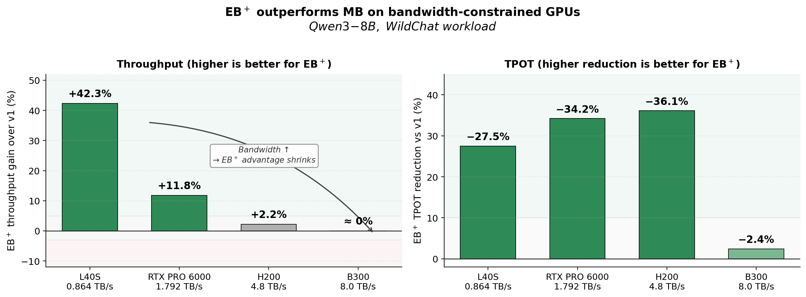
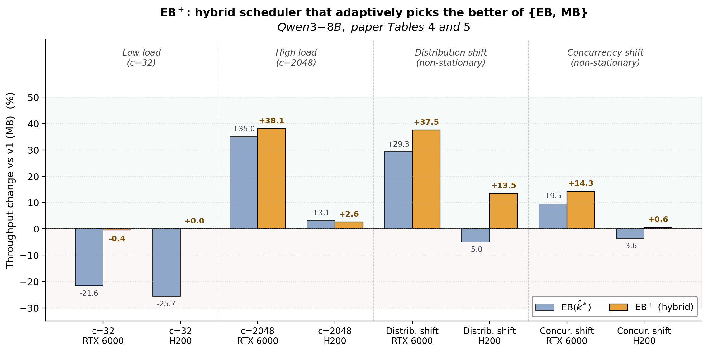
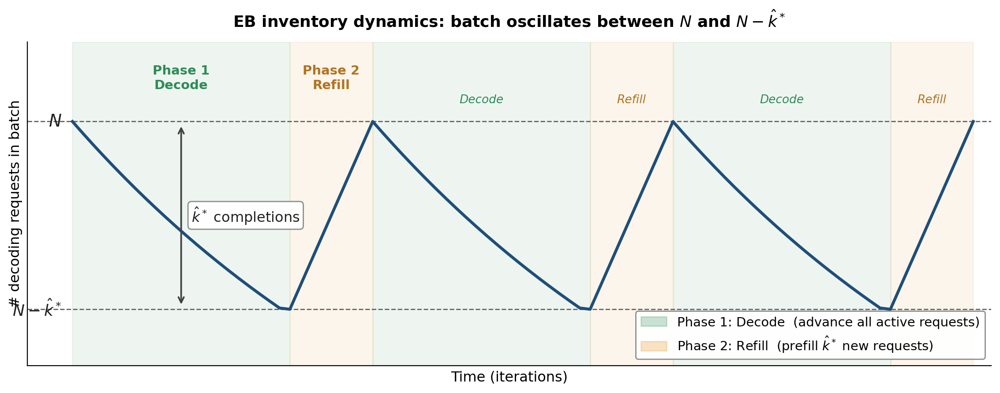

# eb-vllm

**Threshold-Based Exclusive Batching for LLM Inference** — a vLLM extension that adaptively switches between exclusive batching (EB) and mixed batching (MB) to maximize throughput across bandwidth profiles.

[](LICENSE)
[](https://github.com/vllm-project/vllm)
[](#citation)

> Zhang, Nie, Pang, Ma, Wu. *Threshold-Based Exclusive Batching for Memory-Bandwidth-Constrained LLM Inference.* ICML 2026.

---

## 📋 What's in this repo



Mixed batching (MB) — interleaving prefill and decode in the same iteration — is vLLM v1's default. We show that **whether MB or exclusive batching (EB) wins is governed by GPU memory bandwidth**, derive a **closed-form crossover condition**, and ship two new schedulers:

* **EB(k̂\*)** — exclusive batching with an *asymptotically optimal*, online-calibrated phase-switching threshold k̂\* and memory-safe batch size N̂\*.
* **EB⁺** — a hybrid scheduler that applies the crossover condition online to switch between EB and MB; **matches or exceeds v1 (MB) in every tested scenario (worst case: −0.4%).**

### 📊 Headline results (Qwen3-8B, real workloads)

| Hardware | Throughput vs v1 (MB) | TPOT vs v1 (MB) |
|---|---|---|
| L40S (0.864 TB/s) | EB(k̂\*) **+41.9%** | EB(k̂\*) **−27.2%** |
| RTX PRO 6000 (1.792 TB/s) | EB(k̂\*) **+11.3%** (up to +15.3% on ShareGPT) | EB(k̂\*) **−34.7%** |
| H200 (4.8 TB/s) | EB(k̂\*) ≈ v1 | EB(k̂\*) **−35.7%** on decode-heavy |
| B300 (8.0 TB/s) | EB(k̂\*) −2.2% | EB(k̂\*) **−2.7%** |
| Non-stationary traffic (RTX PRO 6000) | EB⁺ **+37.5%** (distribution shift) | EB⁺ **−43%** (distribution shift) |

Source: paper §4.3 (real workloads), §4.4 (EB⁺), §4.5.1 (scalability across GPUs).

---

## 🏆 EB⁺: hybrid wins everywhere

EB(k̂\*) alone is **highly effective on bandwidth-constrained GPUs and at high concurrency**, but it has a known weakness: at low concurrency, when there is not enough decode work to keep the phase-switching pipeline busy, EB pays a cold-start cost that MB does not. **EB⁺ fixes this by evaluating the closed-form crossover condition online and picking the better of {EB, MB} at every update tick.**



The figure above evaluates two regimes:

* **Traffic-level sensitivity** (paper Table 4). Concurrency sweep at μ\_L=512, μ\_O=256. EB(k̂\*) loses to v1 by 21–26% at c=32 because EB's fixed phase-switch overhead is not amortized over enough decode work. EB⁺ detects this regime and stays in MB, recovering v1's throughput to within 0.4%. At c=2048, EB⁺ commits to EB and gains 38% over v1 on RTX PRO 6000.
* **Non-stationary workloads** (paper Table 5). Under sudden distribution shifts (μ\_L:1024→512→128, μ\_O:128→512→1024) or concurrency shifts (c:32→512→1024→256→2048), EB⁺ adapts online and **wins in all 4 (hardware × scenario) cells**, including +37.5% on RTX PRO 6000 under distribution shift.

EB⁺ requires **no manual tuning**: the cost-model parameters (α\_p, α\_d, β\_p, β\_d, α\_MB, β\_MB\^e) are calibrated once per (model, GPU) in minutes; runtime updates are pure integer arithmetic.

---

## 📦 Installation

```bash
git clone https://github.com/weifang231/eb-vllm.git
cd eb-vllm
pip install -e .            # Same install flow as upstream vLLM
```

The new scheduler code lives in [`vllm/v1/core/sched/`](vllm/v1/core/sched/). Reproduction scripts in [`reproduce/`](reproduce/).

## 🚀 Quick start

Run EB(k̂\*) — exclusive batching with online (k̂\*, N̂\*) controller:

```bash
VLLM_USE_PD_SCHEDULER=1 \
VLLM_PD_K_MODE=cfr \
VLLM_PD_AUTO_COMPUTE_N=1 \
VLLM_PD_OOM_TOLERANCE=0.01 \
VLLM_PD_CALIBRATION_FILE=reproduce/calibration/pd_calibration_Qwen3-8B_H200.json \
vllm serve Qwen/Qwen3-8B --max-num-seqs 1024
```

Run EB⁺ — hybrid that auto-selects between EB and MB:

```bash
VLLM_USE_PD_SCHEDULER=1 \
VLLM_PD_SCHEDULER_MODE=auto \
VLLM_PD_K_MODE=cfr \
VLLM_PD_AUTO_COMPUTE_N=1 \
VLLM_PD_CALIBRATION_FILE=reproduce/calibration/pd_calibration_Qwen3-8B_H200.json \
vllm serve Qwen/Qwen3-8B --max-num-seqs 1024
```

`VLLM_PD_CALIBRATION_FILE` points to a per-(model, GPU) cost-model calibration JSON. We ship a sample for Qwen3-8B on H200; see [`reproduce/calibration/README.md`](reproduce/calibration/README.md) for how to generate one for your hardware (a few minutes of GPU time).

## ⚙️ How it works

### Phase machine

Under EB, the scheduler never mixes prefill and decode. The batch oscillates between two phases, and the # of decoding requests in the batch follows a sawtooth between $N$ and $N - \hat{k}^*$:



* **Phase 1 (Decode).** All $N$ active requests advance by one token each iteration. The scheduler counts completions; once the proportion of finished slots meets the closed-form ratio $\theta^* / (1 - \theta^*)$ — equivalently, $\hat{k}^*$ requests have completed — it triggers a switch.
* **Phase 2 (Refill).** The scheduler prefills exactly $\hat{k}^*$ new requests into the vacated slots, then returns to decode with the batch refilled back to $N$. (Under EB⁺, this phase may instead remain in mixed batching when the crossover diagnostic $\Delta(N)$ favors MB.)
* **Cold start.** Phase 0 (not shown) runs once on startup to populate the initial $N$ requests; afterwards the system stays in the Phase 1 ↔ Phase 2 cycle.

This separation eliminates the prefill–decode bandwidth contention that limits MB on memory-bound GPUs.

### Closed-form ingredients

Three closed-form derivations from the paper drive the controller:

1. **Phase-switching threshold (Prop. 1, Thm. 2):** k\*/N converges to a closed-form root of θ/(1−θ) + ln(1−θ) = p₀α\_p/α\_d, with an O(η) correction for hazard-rate slope. Solved by bisection in `_compute_optimal_ratio` / `_compute_optimal_ratio_ifr`.
2. **Memory-safe batch size (Prop. 3):** N̂\* satisfies a CLT-type concentration $N\cdot D(\theta) + \sigma(\theta)\sqrt{N\ln(1/\epsilon)} \le C$, ensuring OOM probability ≤ ε. Solved in closed form in `_compute_memory_safe_n`.
3. **EB–MB crossover (Prop. 4):** the sign of a single scalar Δ(N) determines which strategy wins; computed in `_compute_diagnostic_delta`.

The full online controller (`_update_params_online`) runs in two paths: a **hot path** (per-request, pure integer arithmetic) and a **cold path** (every M completions, computes EMA / hazard-rate fit / θ\* update). See [`vllm/v1/core/sched/scheduler.py`](vllm/v1/core/sched/scheduler.py) for the implementation.

## 🧪 Reproducing the paper

See [`reproduce/REPRODUCTION_REPORT.md`](reproduce/REPRODUCTION_REPORT.md) for the per-figure status table (✅ / ⚠️ / ⛔) and exact commands.

| Paper section | Subdirectory |
|---|---|
| §4.2 Controller validation (Fig. 3) | [`reproduce/validation/`](reproduce/validation/) |
| §4.3.1 Synthetic e2e (Fig. 4) | [`reproduce/synthetic_e2e/`](reproduce/synthetic_e2e/) |
| §4.3.2 Real workloads (Tables 2–3, Figs. 5–6) | [`reproduce/real_workloads/`](reproduce/real_workloads/) |
| §4.4 EB⁺ traffic-level (Table 4) | [`reproduce/eb_plus/traffic/`](reproduce/eb_plus/traffic/) |
| §4.4 EB⁺ non-stationary (Table 5) | [`reproduce/eb_plus/non_stationary/`](reproduce/eb_plus/non_stationary/) |
| §4.5 Cross-GPU / cross-model (Table 6, Fig. 7) | [`reproduce/scalability/`](reproduce/scalability/) |

The README figures are generated by the scripts under [`assets/`](assets/) (`make_header_figure.py`, `make_eb_plus_figure.py`, `make_phase_machine_figure.py`); rerun any of them to regenerate the corresponding PNG.

## 📁 Repository layout

```
eb-vllm/
├── vllm/v1/core/sched/        # Our scheduler additions
│   ├── scheduler.py           # EB scheduler + EB+ controller
│   ├── calibration.py         # Online (k̂*, N̂*) cost-model estimation
│   └── ...
├── reproduce/                 # Paper reproduction harness (per-section subdirs)
├── assets/                    # README figures and helper scripts
└── ...                        # Upstream vLLM files (CMakeLists, csrc/, tests/, ...)
```

## 📝 Citation

```bibtex
@inproceedings{zhang2026eb,
  title     = {Threshold-Based Exclusive Batching for Memory-Bandwidth-Constrained LLM Inference},
  author    = {Zhang, Weifang and Nie, Yuzhou and Pang, Bowen and Ma, Guangrui and Wu, Shining},
  booktitle = {Proceedings of the 43rd International Conference on Machine Learning},
  year      = {2026}
}
```

## ⚖️ License

Apache-2.0, inherited from upstream vLLM. See [`LICENSE`](LICENSE).

## 🙏 Acknowledgement

Built on [vLLM](https://github.com/vllm-project/vllm). We thank the vLLM community for the foundational serving infrastructure.
